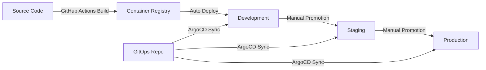

# SGLang Streaming Pipeline: GitHub Actions to ArgoCD Migration Guide

This guide will help you migrate your SGLang streaming pipeline from GitHub Actions to ArgoCD for continuous integration and deployment.

## Table of Contents

1. [Overview](#overview)
2. [Prerequisites](#prerequisites)
3. [Current GitHub Actions Pipeline Analysis](#current-github-actions-pipeline-analysis)
4. [ArgoCD Setup](#argocd-setup)
5. [GitOps Repository Structure](#gitops-repository-structure)
6. [Kubernetes Manifests](#kubernetes-manifests)
7. [ArgoCD Application Configuration](#argocd-application-configuration)
8. [CI/CD Pipeline Migration](#cicd-pipeline-migration)
9. [Secrets Management](#secrets-management)
10. [Monitoring and Troubleshooting](#monitoring-and-troubleshooting)
11. [Best Practices](#best-practices)

## Overview

ArgoCD is a declarative, GitOps continuous delivery tool for Kubernetes. Unlike GitHub Actions which is a CI/CD platform that can deploy to various targets, ArgoCD specifically focuses on deploying and managing applications in Kubernetes clusters using Git as the source of truth.

### Key Differences

- **GitHub Actions**: Push-based deployment (CI/CD runner pushes changes to target)
- **ArgoCD**: Pull-based deployment (ArgoCD pulls changes from Git and applies them to Kubernetes)

## Prerequisites

### Infrastructure Requirements

- Kubernetes cluster (GKE, EKS, AKS, or on-premises)
- ArgoCD installed in your Kubernetes cluster
- Docker registry (Docker Hub, ECR, GCR, etc.)
- Git repository for GitOps manifests

### Tools Required

- `kubectl` CLI
- `argocd` CLI
- `docker` CLI
- `helm` (optional, for Helm-based deployments)

## Current GitHub Actions Pipeline Analysis

Your current pipeline performs these actions:

```yaml
# Current GitHub Actions workflow (.github/workflows/build_push.yaml)
1. Checkout code
2. Free up disk space
3. Set up Docker Buildx
4. Login to DockerHub
5. Build and push Docker image
```

## ArgoCD Setup

### 1. Install ArgoCD in Your Cluster

```bash
# Create ArgoCD namespace
kubectl create namespace argocd

# Install ArgoCD
kubectl apply -n argocd -f https://raw.githubusercontent.com/argoproj/argo-cd/stable/manifests/install.yaml

# Wait for ArgoCD to be ready
kubectl wait --for=condition=available --timeout=300s deployment/argocd-server -n argocd
```

### 2. Access ArgoCD UI

```bash
# Forward port to access ArgoCD UI
kubectl port-forward svc/argocd-server -n argocd 8080:443

# Get initial admin password
kubectl -n argocd get secret argocd-initial-admin-secret -o jsonpath="{.data.password}" | base64 -d
```

### 3. Install ArgoCD CLI

```bash
# Download and install ArgoCD CLI
curl -sSL -o argocd-linux-amd64 https://github.com/argoproj/argo-cd/releases/latest/download/argocd-linux-amd64
sudo install -m 555 argocd-linux-amd64 /usr/local/bin/argocd
rm argocd-linux-amd64
```

## GitOps Repository Structure

Create a separate GitOps repository or use a dedicated folder in your existing repository:

```text
gitops/
├── applications/
│   ├── sglang-dev/
│   │   ├── kustomization.yaml
│   │   ├── deployment.yaml
│   │   ├── service.yaml
│   │   ├── configmap.yaml
│   │   └── secrets.yaml
│   ├── sglang-staging/
│   │   └── ... (similar structure)
│   └── sglang-prod/
│       └── ... (similar structure)
├── argocd-apps/
│   ├── sglang-dev-app.yaml
│   ├── sglang-staging-app.yaml
│   └── sglang-prod-app.yaml
└── README.md
```

## Kubernetes Manifests

### 1. Enhanced Deployment Manifest

Create `gitops/applications/sglang-dev/deployment.yaml`:

```yaml
apiVersion: apps/v1
kind: Deployment
metadata:
  name: sglang-streaming
  labels:
    app: sglang-streaming
    version: v1.0.0
spec:
  replicas: 1
  strategy:
    type: RollingUpdate
    rollingUpdate:
      maxSurge: 1
      maxUnavailable: 0
  selector:
    matchLabels:
      app: sglang-streaming
  template:
    metadata:
      labels:
        app: sglang-streaming
        version: v1.0.0
    spec:
      containers:
      - name: sglang-streaming
        image: your-dockerhub-username/sglang_streaming:latest
        imagePullPolicy: Always
        ports:
        - containerPort: 30000
          name: http-api
        - containerPort: 8000
          name: http-serving
        env:
        - name: HF_TOKEN
          valueFrom:
            secretKeyRef:
              name: sglang-secrets
              key: hf-token
        - name: CUDA_VISIBLE_DEVICES
          value: "0"
        resources:
          requests:
            nvidia.com/gpu: 1
            memory: "8Gi"
            cpu: "2000m"
          limits:
            nvidia.com/gpu: 1
            memory: "16Gi"
            cpu: "4000m"
        volumeMounts:
        - name: shm
          mountPath: /dev/shm
        - name: hf-cache
          mountPath: /root/.cache/huggingface
        - name: model-cache
          mountPath: /root/.cache/modelscope
        livenessProbe:
          httpGet:
            path: /health
            port: 30000
          initialDelaySeconds: 60
          periodSeconds: 30
          timeoutSeconds: 10
        readinessProbe:
          httpGet:
            path: /health
            port: 30000
          initialDelaySeconds: 30
          periodSeconds: 10
          timeoutSeconds: 5
      volumes:
      - name: shm
        emptyDir:
          medium: Memory
          sizeLimit: 10Gi
      - name: hf-cache
        persistentVolumeClaim:
          claimName: hf-cache-pvc
      - name: model-cache
        persistentVolumeClaim:
          claimName: model-cache-pvc
      nodeSelector:
        accelerator: nvidia-tesla-t4  # Adjust based on your GPU nodes
      tolerations:
      - key: nvidia.com/gpu
        operator: Exists
        effect: NoSchedule
```

### 2. Service Manifest

Create `gitops/applications/sglang-dev/service.yaml`:

```yaml
apiVersion: v1
kind: Service
metadata:
  name: sglang-streaming-service
  labels:
    app: sglang-streaming
spec:
  type: LoadBalancer
  selector:
    app: sglang-streaming
  ports:
  - name: api
    port: 30000
    targetPort: 30000
    protocol: TCP
  - name: serving
    port: 8000
    targetPort: 8000
    protocol: TCP
---
apiVersion: v1
kind: Service
metadata:
  name: sglang-streaming-internal
  labels:
    app: sglang-streaming
spec:
  type: ClusterIP
  selector:
    app: sglang-streaming
  ports:
  - name: api
    port: 30000
    targetPort: 30000
  - name: serving
    port: 8000
    targetPort: 8000
```

### 3. ConfigMap for Configuration

Create `gitops/applications/sglang-dev/configmap.yaml`:

```yaml
apiVersion: v1
kind: ConfigMap
metadata:
  name: sglang-config
data:
  model-path: "meta-llama/Llama-3.1-8B-Instruct"
  host: "0.0.0.0"
  port: "30000"
  serving-port: "8000"
  tensor-parallel-size: "1"
  max-running-requests: "100"
  enable-metrics: "true"
  trust-remote-code: "true"
```

### 4. Persistent Volume Claims

Create `gitops/applications/sglang-dev/pvc.yaml`:

```yaml
apiVersion: v1
kind: PersistentVolumeClaim
metadata:
  name: hf-cache-pvc
spec:
  accessModes:
    - ReadWriteOnce
  resources:
    requests:
      storage: 50Gi
  storageClassName: fast-ssd
---
apiVersion: v1
kind: PersistentVolumeClaim
metadata:
  name: model-cache-pvc
spec:
  accessModes:
    - ReadWriteOnce
  resources:
    requests:
      storage: 100Gi
  storageClassName: fast-ssd
```

### 5. Kustomization File

Create `gitops/applications/sglang-dev/kustomization.yaml`:

```yaml
apiVersion: kustomize.config.k8s.io/v1beta1
kind: Kustomization

resources:
  - deployment.yaml
  - service.yaml
  - configmap.yaml
  - pvc.yaml

images:
  - name: your-dockerhub-username/sglang_streaming
    newTag: latest

commonLabels:
  environment: development
  managed-by: argocd

namespace: sglang-dev
```

## ArgoCD Application Configuration

### 1. Development Environment Application

Create `gitops/argocd-apps/sglang-dev-app.yaml`:

```yaml
apiVersion: argoproj.io/v1alpha1
kind: Application
metadata:
  name: sglang-streaming-dev
  namespace: argocd
  labels:
    app: sglang-streaming
    environment: development
spec:
  project: default
  
  # Source configuration - your GitOps repository
  source:
    repoURL: https://github.com/your-org/sglang-gitops.git
    path: applications/sglang-dev
    targetRevision: HEAD
    
  # Destination configuration - your Kubernetes cluster
  destination:
    server: https://kubernetes.default.svc
    namespace: sglang-dev
    
  # Sync policy
  syncPolicy:
    automated:
      prune: true
      selfHeal: true
      allowEmpty: false
    syncOptions:
      - CreateNamespace=true
      - PruneLast=true
      - RespectIgnoreDifferences=true
    retry:
      limit: 5
      backoff:
        duration: 5s
        factor: 2
        maxDuration: 3m
        
  # Health check and diff customization
  ignoreDifferences:
    - group: apps
      kind: Deployment
      jsonPointers:
        - /spec/replicas
        
  # Notification configuration
  revisionHistoryLimit: 10
```

### 2. Production Environment Application

Create `gitops/argocd-apps/sglang-prod-app.yaml`:

```yaml
apiVersion: argoproj.io/v1alpha1
kind: Application
metadata:
  name: sglang-streaming-prod
  namespace: argocd
  labels:
    app: sglang-streaming
    environment: production
spec:
  project: default
  
  source:
    repoURL: https://github.com/your-org/sglang-gitops.git
    path: applications/sglang-prod
    targetRevision: HEAD
    
  destination:
    server: https://kubernetes.default.svc
    namespace: sglang-prod
    
  syncPolicy:
    # Manual sync for production
    automated: null
    syncOptions:
      - CreateNamespace=true
      - PruneLast=true
    retry:
      limit: 3
      backoff:
        duration: 10s
        factor: 2
        maxDuration: 5m
```

## CI/CD Pipeline Migration

### 1. Updated GitHub Actions Workflow

Replace your existing `.github/workflows/build_push.yaml` with:

```yaml
name: Build and Update GitOps

on:
  push:
    branches: [main]
  pull_request:
    branches: [main]
  workflow_dispatch:

jobs:
  build-and-update-gitops:
    runs-on: ubuntu-latest
    
    steps:
      - name: Checkout source code
        uses: actions/checkout@v4
        with:
          fetch-depth: 0

      - name: Free up disk space
        run: |
          echo "Before cleanup:"
          df -h
          sudo rm -rf /usr/share/dotnet /usr/local/lib/android /opt/ghc
          sudo apt-get clean
          echo "After cleanup:"
          df -h

      - name: Set up Docker Buildx
        uses: docker/setup-buildx-action@v3

      - name: Login to DockerHub
        uses: docker/login-action@v3
        with:
          username: ${{ secrets.DOCKERHUB_USERNAME }}
          password: ${{ secrets.DOCKERHUB_TOKEN }}

      - name: Generate image tag
        id: image-tag
        run: |
          if [[ "${{ github.event_name }}" == "pull_request" ]]; then
            echo "tag=pr-${{ github.event.number }}-${{ github.sha }}" >> $GITHUB_OUTPUT
          else
            echo "tag=${{ github.sha }}" >> $GITHUB_OUTPUT
          fi

      - name: Build and push Docker image
        uses: docker/build-push-action@v5
        with:
          context: .
          file: ./docker/Dockerfile
          push: true
          tags: |
            ${{ secrets.DOCKERHUB_USERNAME }}/sglang_streaming:${{ steps.image-tag.outputs.tag }}
            ${{ secrets.DOCKERHUB_USERNAME }}/sglang_streaming:latest
          cache-from: type=registry,ref=${{ secrets.DOCKERHUB_USERNAME }}/sglang_streaming:buildcache
          cache-to: type=registry,ref=${{ secrets.DOCKERHUB_USERNAME }}/sglang_streaming:buildcache,mode=max

      - name: Checkout GitOps repository
        uses: actions/checkout@v4
        with:
          repository: your-org/sglang-gitops  # Replace with your GitOps repo
          token: ${{ secrets.GITOPS_TOKEN }}
          path: gitops-repo

      - name: Update image tag in GitOps repo
        run: |
          cd gitops-repo
          
          # Update development environment (auto-deploy from main branch)
          if [[ "${{ github.ref }}" == "refs/heads/main" ]]; then
            sed -i 's|newTag: .*|newTag: ${{ steps.image-tag.outputs.tag }}|' applications/sglang-dev/kustomization.yaml
            
            git config user.name "github-actions[bot]"
            git config user.email "github-actions[bot]@users.noreply.github.com"
            git add applications/sglang-dev/kustomization.yaml
            git commit -m "Update sglang-dev image to ${{ steps.image-tag.outputs.tag }}"
            git push
          fi

      - name: Create PR for production deployment
        if: github.ref == 'refs/heads/main'
        uses: peter-evans/create-pull-request@v5
        with:
          token: ${{ secrets.GITOPS_TOKEN }}
          path: gitops-repo
          commit-message: "Update sglang-prod image to ${{ steps.image-tag.outputs.tag }}"
          title: "Deploy sglang-streaming ${{ steps.image-tag.outputs.tag }} to production"
          body: |
            ## Production Deployment Request
            
            **Image**: `${{ secrets.DOCKERHUB_USERNAME }}/sglang_streaming:${{ steps.image-tag.outputs.tag }}`
            **Commit**: ${{ github.sha }}
            **Branch**: ${{ github.ref_name }}
            
            ### Changes
            ${{ github.event.head_commit.message }}
            
            ### Checklist
            - [ ] Review deployment manifests
            - [ ] Verify image security scan results
            - [ ] Confirm staging tests passed
            - [ ] Schedule maintenance window if needed
          branch: deploy-prod-${{ steps.image-tag.outputs.tag }}
          delete-branch: true
```

### 2. Separate Image Build and GitOps Update

For better separation of concerns, you can also split this into two workflows:

**Build Workflow** (`.github/workflows/build.yaml`):
```yaml
name: Build and Push Image

on:
  push:
    branches: [main, develop]
  pull_request:
    branches: [main]

jobs:
  build:
    runs-on: ubuntu-latest
    outputs:
      image-tag: ${{ steps.image-tag.outputs.tag }}
    
    steps:
      # ... (same build steps as above)
      
      - name: Trigger GitOps update
        if: github.ref == 'refs/heads/main'
        uses: peter-evans/repository-dispatch@v2
        with:
          token: ${{ secrets.GITOPS_TOKEN }}
          repository: your-org/sglang-gitops
          event-type: update-image
          client-payload: |
            {
              "image_tag": "${{ steps.image-tag.outputs.tag }}",
              "environment": "development",
              "source_commit": "${{ github.sha }}",
              "source_repo": "${{ github.repository }}"
            }
```

## Secrets Management

### 1. Kubernetes Secrets

Create secrets in your cluster:

```bash
# Create namespace
kubectl create namespace sglang-dev

# Create secrets
kubectl create secret generic sglang-secrets \
  --from-literal=hf-token="your-huggingface-token" \
  --from-literal=dockerhub-username="your-dockerhub-username" \
  --from-literal=dockerhub-token="your-dockerhub-token" \
  -n sglang-dev
```

### 2. External Secrets Operator (Recommended)

For production environments, use External Secrets Operator with cloud secret managers:

```yaml
apiVersion: external-secrets.io/v1beta1
kind: SecretStore
metadata:
  name: aws-secrets-manager
  namespace: sglang-dev
spec:
  provider:
    aws:
      service: SecretsManager
      region: us-west-2
      auth:
        jwt:
          serviceAccountRef:
            name: external-secrets-sa
---
apiVersion: external-secrets.io/v1beta1
kind: ExternalSecret
metadata:
  name: sglang-secrets
  namespace: sglang-dev
spec:
  refreshInterval: 1h
  secretStoreRef:
    name: aws-secrets-manager
    kind: SecretStore
  target:
    name: sglang-secrets
    creationPolicy: Owner
  data:
  - secretKey: hf-token
    remoteRef:
      key: sglang/huggingface-token
  - secretKey: api-key
    remoteRef:
      key: sglang/api-key
```

## Monitoring and Troubleshooting

### 1. ArgoCD Application Health Monitoring

```bash
# Check application status
argocd app list

# Get detailed application info
argocd app get sglang-streaming-dev

# View application logs
argocd app logs sglang-streaming-dev

# Manual sync
argocd app sync sglang-streaming-dev

# Rollback to previous version
argocd app rollback sglang-streaming-dev
```

### 2. Kubernetes Monitoring

```bash
# Check pod status
kubectl get pods -n sglang-dev

# View pod logs
kubectl logs -f deployment/sglang-streaming -n sglang-dev

# Describe deployment
kubectl describe deployment sglang-streaming -n sglang-dev

# Check events
kubectl get events -n sglang-dev --sort-by='.lastTimestamp'
```

### 3. Resource Monitoring

Create monitoring manifests in `gitops/applications/sglang-dev/monitoring.yaml`:

```yaml
apiVersion: v1
kind: ServiceMonitor
metadata:
  name: sglang-streaming-metrics
  labels:
    release: prometheus
spec:
  selector:
    matchLabels:
      app: sglang-streaming
  endpoints:
  - port: metrics
    path: /metrics
    interval: 30s
---
apiVersion: networking.k8s.io/v1
kind: Ingress
metadata:
  name: sglang-streaming-ingress
  annotations:
    nginx.ingress.kubernetes.io/rewrite-target: /
    cert-manager.io/cluster-issuer: letsencrypt-prod
spec:
  tls:
  - hosts:
    - sglang-dev.yourdomain.com
    secretName: sglang-dev-tls
  rules:
  - host: sglang-dev.yourdomain.com
    http:
      paths:
      - path: /
        pathType: Prefix
        backend:
          service:
            name: sglang-streaming-service
            port:
              number: 30000
```

## Best Practices

### 1. Environment Promotion Strategy



### 2. GitOps Repository Structure Best Practices

- **Separate repositories**: Keep application source code and GitOps manifests in separate repositories
- **Environment branches**: Use branches for different environments (main, staging, production)
- **Versioned releases**: Tag GitOps repository for production releases
- **Security scanning**: Implement security scanning for both source code and manifests

### 3. ArgoCD Configuration Best Practices

```yaml
# Configure ArgoCD for better performance and security
apiVersion: v1
kind: ConfigMap
metadata:
  name: argocd-cmd-params-cm
  namespace: argocd
data:
  # Increase sync timeout
  timeout.reconciliation: 300s
  
  # Enable resource tracking
  application.instanceLabelKey: argocd.argoproj.io/instance
  
  # Security settings
  server.insecure: "false"
  server.grpc.web: "true"
```

### 4. Rollback Strategy

Create a rollback script:

```bash
#!/bin/bash
# rollback.sh

APP_NAME="sglang-streaming-dev"
TARGET_REVISION=${1:-HEAD~1}

echo "Rolling back $APP_NAME to $TARGET_REVISION"

# Get current sync revision
CURRENT_REV=$(argocd app get $APP_NAME -o json | jq -r '.status.sync.revision')
echo "Current revision: $CURRENT_REV"

# Sync to target revision
argocd app sync $APP_NAME --revision $TARGET_REVISION

# Wait for sync to complete
argocd app wait $APP_NAME --timeout 300

echo "Rollback completed"
```

### 5. Multi-Cluster Deployment

For multiple clusters, create cluster-specific applications:

```yaml
# Cluster 1 - US West
apiVersion: argoproj.io/v1alpha1
kind: Application
metadata:
  name: sglang-streaming-us-west
  namespace: argocd
spec:
  project: default
  source:
    repoURL: https://github.com/your-org/sglang-gitops.git
    path: applications/sglang-prod
    targetRevision: HEAD
  destination:
    server: https://us-west-cluster.example.com
    namespace: sglang-prod
---
# Cluster 2 - EU Central
apiVersion: argoproj.io/v1alpha1
kind: Application
metadata:
  name: sglang-streaming-eu-central
  namespace: argocd
spec:
  project: default
  source:
    repoURL: https://github.com/your-org/sglang-gitops.git
    path: applications/sglang-prod
    targetRevision: HEAD
  destination:
    server: https://eu-central-cluster.example.com
    namespace: sglang-prod
```

## Conclusion

This migration guide provides a comprehensive approach to moving from GitHub Actions to ArgoCD for your SGLang streaming pipeline. The key benefits of this approach include:

- **GitOps principles**: All deployments are driven by Git commits
- **Declarative configuration**: Infrastructure and applications are defined as code
- **Automated synchronization**: ArgoCD continuously monitors and syncs your applications
- **Rollback capabilities**: Easy rollback to previous versions
- **Multi-environment support**: Separate configuration for dev, staging, and production
- **Security**: Reduced attack surface with pull-based deployments

Remember to test this setup in a development environment before applying it to production, and gradually migrate one environment at a time to minimize risks.
